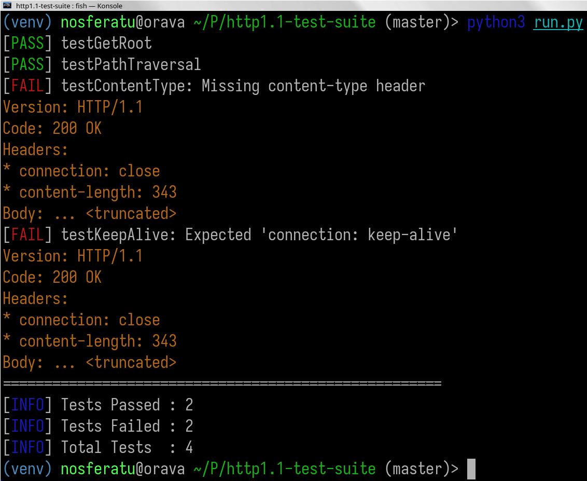

## Getting Started

```bash
python3 -m venv venv
source ./venv/bin/activate
pip install -r requirements.txt
python3 run.py # Edit run.py to configure host and port.
```

> For stricter testing: set `STRICT_MODE` to `True` inside [run.py](run.py).

## About

This project is not a full-fledged test suite or a complete HTTP/1.1
conformance tool (yet). Its current purpose is to support and validate
development of my HTTP server: <https://gitlab.com/ninthcircle/outpost>.
The long-term goal is to evolve this into a more comprehensive testing tool,
but for now it is focused on practical testing needs for `outpost-http-server`.
